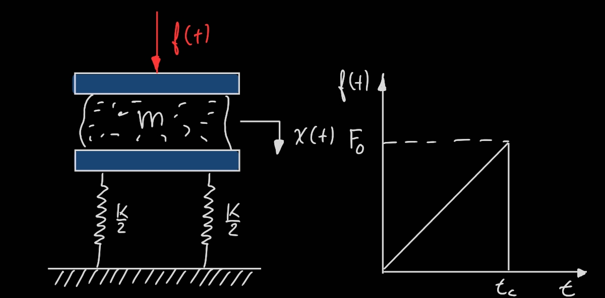

# MechanicalVibrations Repository
#By Vasco Pires, Mechanical Engineer Student@FEUP

#Most of the code in this repository can be applied to mechanical vibrations problems, allowing students to visualize problems using interactive graphs and ticking with the problems' parameters and  initial conditions.

